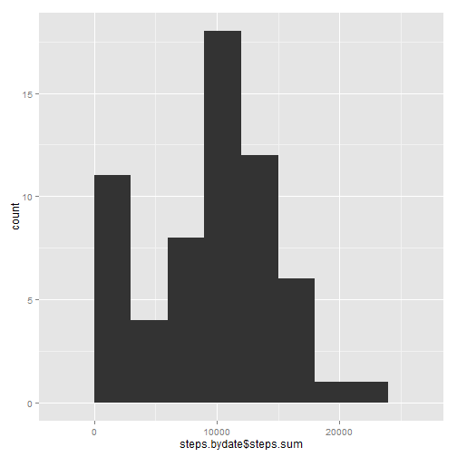
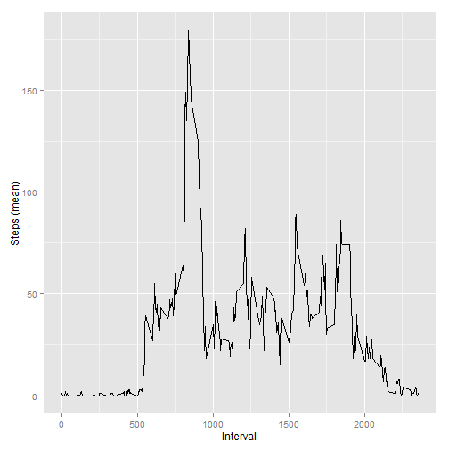
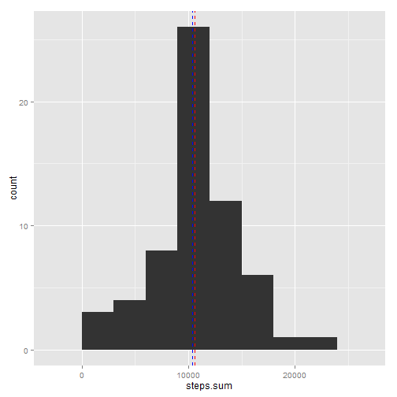
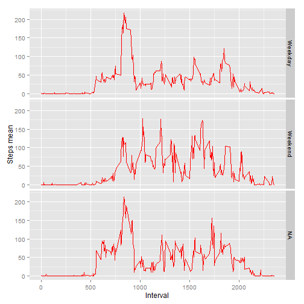

_It is now possible to collect a large amount of data about personal movement using activity monitoring devices such as a Fitbit, Nike Fuelband, or Jawbone Up. These type of devices are part of the “quantified self” movement – a group of enthusiasts who take measurements about themselves regularly to improve their health, to find patterns in their behavior, or because they are tech geeks. But these data remain under-utilized both because the raw data are hard to obtain and there is a lack of statistical methods and software for processing and interpreting the data._


## About the data set


* Dataset: Activity monitoring data [52K]

The variables included in this dataset are:

* steps: Number of steps taking in a 5-minute interval (missing values are coded as NA)

* date: The date on which the measurement was taken in YYYY-MM-DD format

* interval: Identifier for the 5-minute interval in which measurement was taken

The dataset is stored in a comma-separated-value (CSV) file and there are a total of 17,568 observations in this dataset.


You can donwload it from here: [Activity monitoring data](https://d396qusza40orc.cloudfront.net/repdata%2Fdata%2Factivity.zip).


## Loading and preprocessing the data

For the entire project, we'll need to use basically two librarys: `dplyr` and `ggplot2`, so let's load them first:


```r
library(dplyr)
library(ggplot2)
```


Then we need `read.csv()` to load the data.


```r
activity <- read.csv("Z:\\OMAR\\RCoursera\\RepData\\RepData_PeerAssessment1\\activity.csv")
```


We have a column with dates information. So, just to be sure, we're going to give it the right format with `as.Date()`:


```r
activity$date <- as.Date(activity$date)
```


## What is mean total number of steps taken per day?

### Calculate the total number of steps taken per day

To solve this, you can use the original data set `activity` and the function `sum`:


```r
sum(activity$steps, na.rm = T)
```

```
## [1] 570608
```

### Make a histogram of the total number of steps taken each day


To answer this, we need to:

1. Group the number of steps by date.
2. Make a histogram of the steps by date.


To group the number of steps by date, We're going to use the `dplyr` library, as follows:


```r
steps.bydate <- activity %>%
                group_by(date) %>%
                summarise(steps.sum = sum(steps, na.rm = T),
                          steps.mean = mean(steps, na.rm = T))
```


Now we can plot the total number of steps taken each day:


```r
ggplot(data=steps.bydate, aes(steps.bydate$steps.sum)) + geom_histogram(binwidth = 3000)
```

 


## Calculate and report the mean and median of the total number of steps taken per day


```r
mean(steps.bydate$steps.sum, na.rm = T)
```

```
## [1] 9354.23
```

```r
median(steps.bydate$steps.sum, na.rm = T)
```

```
## [1] 10395
```


## What is the average daily activity pattern?


1. Make a time series plot (i.e. type = "l") of the 5-minute interval (x-axis) and the average number of steps taken, averaged across all days (y-axis)

To solve this, We need to:

1.1 group by interval.
1.2 Then sum up the steps by interval.
1.3 And finally divide the steps by 61 (to get the daily activity pattern).  

We divide the sum of steps by interval by 61, because there are 61 intervals for each date. So `sum of steps by interval/61` gives us what we need.


```r
activity.pattern <- activity %>%
    group_by(interval) %>%
    summarise(steps.sum = sum(steps, na.rm = T),
              steps.mean = round(steps.sum/61, 0))
```


```r
ggplot(data=activity.pattern,
       aes(x = activity.pattern$interval, y = activity.pattern$steps.mean)) +
    labs(y = "Steps (mean)", x = "Interval") +
    geom_line()
```

 


### Which 5-minute interval, on average across all the days in the dataset contains the maximum number of steps?


```r
max.steps.sum <- max(activity.pattern$steps.sum)

activity.pattern[activity.pattern$steps.sum == max.steps.sum,]
```

```
## Source: local data frame [1 x 3]
## 
##   interval steps.sum steps.mean
## 1      835     10927        179
```


## Imputing missing values (NAs)


### Calculate and report the total number of missing values in the dataset (i.e. the total number of rows with NAs)


```r
sum(!complete.cases(activity))
```

```
## [1] 2304
```


### Devise a strategy for filling in all of the missing values in the dataset. The strategy does not need to be sophisticated. For example, you could use the mean/median for that day, or the mean for that 5-minute interval, etc.


```r
activity$steps <- ifelse(is.na(activity$steps) == TRUE,
                                  activity.pattern$steps.mean[activity.pattern$interval %in% activity$interval], activity$steps)
```


### Create a new dataset that is equal to the original dataset but with the missing data filled in.


```r
activity.complete <- activity
```


## Make a histogram of the total number of steps taken each day and Calculate and report the mean and median total number of steps taken per day. Do these values differ from the estimates from the first part of the assignment? What is the impact of imputing missing data on the estimates of the total daily number of steps?


```r
activity.complete.bydate <- activity.complete %>%
    group_by(date) %>%
    summarise(steps.sum = sum(steps, na.rm = T),
              steps.mean = mean(steps, na.rm = T))
```


```r
ggplot(data=activity.complete.bydate, aes(x = steps.sum)) + geom_histogram(binwidth = 3000) +
geom_vline(aes(xintercept=mean(steps.sum, na.rm = T)), colour="red", size=0.5, linetype="dashed") +
geom_vline(aes(xintercept=median(steps.sum, na.rm = T)), colour="blue", size=0.5, linetype="dashed")     
```

 


If we compare the original data set (with NAs) and the imputed missing data set, we see that:

* The `sum` of steps is what changes more: from 570,608 to 645,424.
* The `mean` of steps has an increment: from 9354.23 to 10580.72.
* The `median` of steps does not change. Before: 10395, after: 10395.


```r
sum(activity.complete.bydate$steps.sum) # From 570608 to 645424
```

```
## [1] 645424
```

```r
mean(activity.complete.bydate$steps.sum) # From 9354.23 to 10580.72
```

```
## [1] 10580.72
```

```r
median(activity.complete.bydate$steps.sum) # Before: 10395, after: 10395. Does not change.
```

```
## [1] 10395
```


## Are there differences in activity patterns between weekdays and weekends?


### Create a new factor variable in the dataset with two levels – “weekday” and “weekend” indicating whether a given date is a weekday or weekend day.


  
  

Let's use the `weekdays()` function to get the days from the `date` column, and create a new column `days`


```r
activity.complete$days <- weekdays(activity$date)
```


Now let's create a column with 2 factors: `Weekday` and `Weekend`. For this, we're going to use the days return from the funcion`weekdays()`, and an `ifelse` construction, with some `regex`.


```r
activity.complete <- mutate(activity.complete,
                   Weekday = NA,
                   Weekday = ifelse(grepl("lunes", days)
                                    | grepl("martes", days) | grepl("miércoles", days)
                                    | grepl("jueves", days) | grepl("viernes", days),
                                    "Weekday", Weekday),
                             
                   Weekday = ifelse(grepl("sábado", days)
                                   | grepl("domingo", days),
                                   "Weekend", Weekday))
```


```r
Weekdays.plot <- activity.complete %>%
                 group_by(Weekday, interval) %>%
                 summarise(steps_mean = mean(steps, na.rm = T))
```

### Make a panel plot containing a time series plot (i.e. type = "l") of the 5-minute interval (x-axis) and the average number of steps taken, averaged across all weekday days or weekend days (y-axis).


Yes. Wee see some differences in the 5-minute interval:

* Interval 500 to 1000: the mean of steps is higher in weekdays. 

* Interval 1000 to 1500: The mean of steps is more stable on week days. In weekend days the means are higher, but not so continuos (we can apreciate some peaks on the data). 

* Interval 1500 to 2000: There is more activity at the end of the day on weekend days than in week days. We can appreciate more volume of steps in this range for Weekend days.  


+ _Weekday days (interval  > 1,500)_


```
## [1] NA
```


+ _Weekend days (interval  > 1,500)_


```
## [1] NA
```


```r
ggplot(data = Weekdays.plot, aes(x = interval, y = steps_mean))  +
     geom_line(color = "red") +
     labs(y = "Steps mean", x = "Interval")  +
     facet_grid(Weekday ~ .)
```

 


